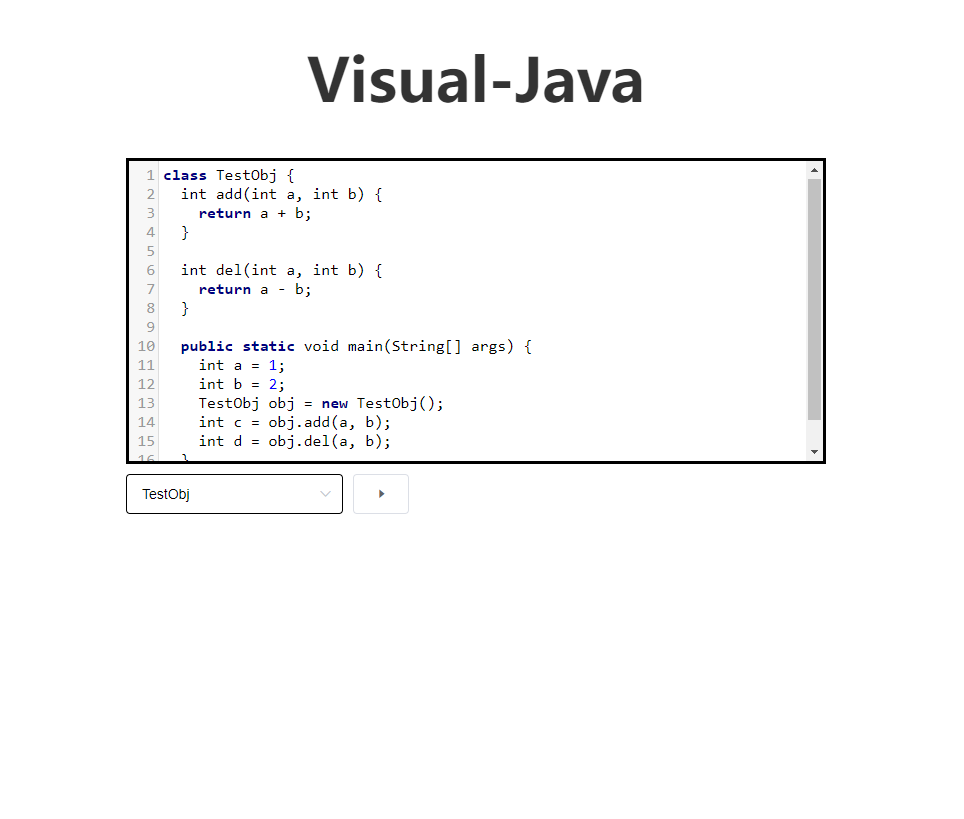
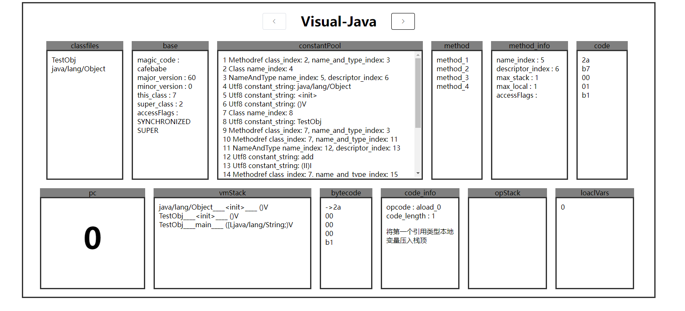

# visual-java-web

## Project setup
```
npm install
```

### Compiles and hot-reloads for development
```
npm run serve
```

### Compiles and minifies for production
```
npm run build
```

### Lints and fixes files
```
npm run lint
```
### run server
```
cd server
npm server.js
```
### Customize configuration
See [Configuration Reference](https://cli.vuejs.org/config/).

效果图


